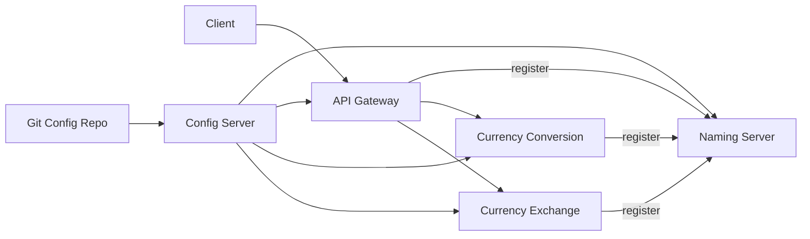

# Spring Cloud Microservices System

This repository has 3 workspaces named local, docker-compose, and kubernetes. Each workspace has Spring Cloud services for local, Docker, and Kubernetes.

## Why 3 Workspaces

| Workspace         | Focus                                                                |
| ----------------- | -------------------------------------------------------------------- |
| `local/`          | Shows how Spring Cloud components work together (Config/Eureka/Gateway). |
| `docker-compose/` | Shows how to integrate Spring Cloud with Docker.               |
| `kubernetes/`     | Shows how Spring Boot services are handled on Kubernetes.      |

## Architecture

Spring Cloud Config Server sources properties from the Git-backed repository inside `local/git-localconfig-repo`.
Every runtime connects to the Config Server and exposes actuator endpoints for diagnostics.
The Eureka naming server collects registrations from Currency Exchange Service, Currency Conversion Service, and API Gateway, which means client code relies on logical service identifiers instead of literal host names.
The API Gateway becomes the single entry point in all environments, providing proxying.



## Modules

| Module                              | Port | Purpose                                                                                                       |
| ----------------------------------- | ---- | ------------------------------------------------------------------------------------------------------------- |
| `local/spring-cloud-config-server`  | 8888 | Shares configuration from `local/git-localconfig-repo`.                                                       |
| `local/naming-server`               | 8761 | The Eureka service, which is the discovery server so that every service can register and locate one another.  |
| `local/currency-exchange-service`   | 8000 | Provides currency exchange from the in-memory H2 database.                                                    |
| `local/currency-conversion-service` | 8100 | The business logic is here, which will call currency-exchange-service to get the currency and then calculate. |
| `local/api-gateway`                 | 8765 | The gateway that provides different entry points for APIs.                                                    |

## Workspace Components

| Workspace         | Config Server | Eureka | API Gateway | Exchange | Conversion | Config Source                                  |
| ----------------- | ------------- | ------ | ----------- | -------- | ---------- | ---------------------------------------------- |
| `local/`          | Yes           | Yes    | Yes         | Yes      | Yes        | `local/git-localconfig-repo` via Config Server |
| `docker-compose/` | No            | Yes    | Yes         | Yes      | Yes        | `application.properties` in every service      |
| `kubernetes/`     | No            | No     | No          | Yes      | Yes        | App config + ConfigMap in `deployment.yaml`    |

In Docker, the environment only keeps the required services for the request flow, so the Config Server is removed.
In Kubernetes, Service discovery and Ingress are used, so Config Server, Eureka, and Gateway are not included.

## Environment

Every environment section has instructions with commands.

### Local Development

The local workspace keeps pure Maven modules for direct execution on your environment. The config server reads the embedded Git repository, Eureka tracks each service, and the gateway provides proxying.

#### Guided Path

Ensure the JDK version is 17, Maven version is 3.9+, and Git is available.

#### Command Reference

```bash
cd local/spring-cloud-config-server
mvn spring-boot:run
```

```bash
cd local/naming-server
mvn spring-boot:run
```

Start each backend service in its own terminal:

```bash
cd local/currency-exchange-service && mvn spring-boot:run
```

```bash
cd local/currency-conversion-service && mvn spring-boot:run
```

Test the APIs to check if they can be called:

```bash
curl http://localhost:8000/currency-exchange/from/USD/to/TWD
curl http://localhost:8100/currency-conversion/from/USD/to/TWD/quantity/10
curl http://localhost:8100/currency-conversion-feign/from/EUR/to/TWD/quantity/10
```

Start the gateway and route traffic through it:

```bash
cd local/api-gateway && mvn spring-boot:run
```

```bash
curl http://localhost:8765/currency-conversion/from/USD/to/TWD/quantity/10
curl http://localhost:8765/currency-conversion-new/from/USD/to/TWD/quantity/10
```

#### Smoke Test

```bash
curl http://localhost:8000/currency-exchange/from/USD/to/TWD
curl http://localhost:8765/currency-conversion-feign/from/USD/to/TWD/quantity/10
```

### Docker

Spring Cloud on Docker is just like the local environment, but it is optimized for containers and uses Docker images without manual Dockerfiles.
This environment does not include Config Server, so configuration comes from `application.properties` in each service.

#### Guided Path

Ensure Docker is installed and running on the host.

#### Command Reference

Build images:

```bash
cd docker-compose/
cd ./naming-server && mvn -DskipTests spring-boot:build-image && cd ../

cd ./currency-exchange-service && mvn -DskipTests spring-boot:build-image && cd ../

cd ./currency-conversion-service && mvn -DskipTests spring-boot:build-image && cd ../

cd ./api-gateway && mvn -DskipTests spring-boot:build-image && cd ../
```

Start the services:

```bash
docker compose -f docker-compose.yaml up -d
```

Test through the gateway:

```bash
curl http://localhost:8765/currency-conversion/from/USD/to/TWD/quantity/10

curl http://localhost:8765/currency-conversion-new/from/USD/to/TWD/quantity/10
```

View logs of a specific service:

```bash
docker compose logs -f currency-exchange
```

Tear down and clean up the environment:

```bash
docker compose -f docker-compose.yaml down --remove-orphans
```

Delete all images with the "springboot/" prefix.

```bash
docker images --format '{{.Repository}}:{{.Tag}}' | grep '^springboot/' | xargs -r docker rmi
```

#### Smoke Test

Docker:

```bash
docker compose -f docker-compose.yaml up -d
curl http://localhost:8765/currency-conversion-feign/from/USD/to/TWD/quantity/10
docker compose -f docker-compose.yaml down --remove-orphans
```

### Kubernetes

The Kubernetes environment includes Currency Exchange Service and Currency Conversion Service. The environment shows how Spring Cloud is run on Kubernetes.
In Kubernetes:
- Service discovery is usually provided by Kubernetes Service + DNS, so Eureka is not always required.
- External entry is usually provided by Ingress / Gateway API, so Spring Cloud Gateway is not always required.
- Configuration is usually provided by ConfigMap / Secret, so Config Server is not always required.
- This workspace focuses on showing the same microservices deployed and exposed with Kubernetes features.

#### macOS Setup (Clean and Minimal)

This setup uses kind (Kubernetes in Docker). It keeps your host clean and is easy to remove.

Install tools:

```bash
brew install kind
```

Create a local cluster:

```bash
kind create cluster --name scms
```

Verify the cluster:

```bash
kubectl cluster-info
kubectl get nodes
```

Clean removal:

```bash
kind delete cluster --name scms
# Optional
# Uninstall kind
# brew uninstall kind
```

Optional cleanup if you want to remove kube config data:

```bash
rm -rf ~/.kube
```

#### Command Reference

Build Docker images and load them into Kubernetes:

```bash
cd kubernetes/

cd ./currency-exchange-service && mvn -DskipTests spring-boot:build-image

cd ../currency-conversion-service && mvn -DskipTests spring-boot:build-image

cd ../

# Delete images in Kubernetes first
docker exec -it scms-control-plane crictl rmi springboot/mmv3-currency-conversion-service:0.0.1-Kubernetes
docker exec -it scms-control-plane crictl rmi springboot/mmv3-currency-exchange-service:0.0.1-Kubernetes

# Load images to Kubernetes
kind load docker-image springboot/mmv3-currency-conversion-service:0.0.1-Kubernetes --name scms
kind load docker-image springboot/mmv3-currency-exchange-service:0.0.1-Kubernetes --name scms
```

Apply the deployments:

```bash
kubectl apply -f currency-exchange-service/deployment.yaml
kubectl apply -f currency-conversion-service/deployment.yaml
```

Inspect resources:

```bash
kubectl get deployment
kubectl get pods
kubectl get services currency-exchange currency-conversion
```

Port forward for local testing:

```bash
kubectl port-forward service/currency-exchange 8000:8000
```

```bash
kubectl port-forward service/currency-conversion 8100:8100
```

In Kubernetes, we need to expose services with Service or Ingress. Forwarding ports is used here for a quick demo.

```bash
curl http://localhost:8100/currency-conversion-feign/from/USD/to/TWD/quantity/10
```

Scale replicas:

```bash
kubectl scale deployment currency-exchange --replicas=3

kubectl get pods
```

The output will change from:

```text
NAME                  READY   UP-TO-DATE   AVAILABLE   AGE
currency-conversion   1/1     1            1           43s
currency-exchange     1/1     1            1           43s
```

To this:

```text
NAME                  READY   UP-TO-DATE   AVAILABLE   AGE
currency-conversion   1/1     1            1           46s
currency-exchange     1/3     3            1           46s
```

Clean up Kubernetes resources and images:

```bash
kubectl delete deployment currency-conversion currency-exchange
kubectl delete service currency-conversion currency-exchange
kubectl delete pods -l app=currency-conversion
kubectl delete pods -l app=currency-exchange
```

If you are using kind, remove the images from the node:

```bash
docker exec -it scms-control-plane crictl rmi springboot/mmv3-currency-conversion-service:0.0.1-Kubernetes
docker exec -it scms-control-plane crictl rmi springboot/mmv3-currency-exchange-service:0.0.1-Kubernetes
```

#### Smoke Test

```bash
kubectl apply -f currency-exchange-service/deployment.yaml
kubectl apply -f currency-conversion-service/deployment.yaml
curl http://localhost:8100/currency-conversion-feign/from/USD/to/TWD/quantity/10
```

## Repository Utilities

Clear all Maven target folders when you want a clean slate:

```bash
find . -name target -type d -prune -exec rm -rf {} +
```

Remove leftover containers and images from Docker experiments:

```bash
docker container prune -f
docker image prune -f
```

## Credit

- [in28minutes](https://github.com/in28minutes/spring-microservices-v3/tree/main)
